# Hi there! 👋 I'm Gyandutt Mishra

<div align="center">
  
</div>

<div align="center">
  
  
  
</div>


## 🚀 About Me


> *"The only way to do great work is to love what you do."* – Steve Jobs

- 🎓 **MCA Student** at School of Management Science (SMS), Varanasi (2024–2026)
- 💻 **Aspiring Full Stack Developer** with strong fundamentals in DSA & Problem Solving
- 🧮 **Mathematics Graduate** with a solid analytical background
- 🎯 **Goal:** Master Full Stack Development, DSA, and contribute to open-source projects
- 🏆 **Achievement:** Successfully cleared BSF exam
- 📚 **Always learning** new technologies and improving problem-solving skills
- 💡 **Passionate** about creating efficient solutions and clean code
- 🌱 **Currently exploring** advanced React patterns and system design


## 🛠️ Skills & Technologies

<div align="center">

### 💻 Programming Languages


### 🌐 Frontend Development


### ⚙️ Backend Development


### 🗄️ Database & Tools


### 📊 Data Structures & Algorithms


</div>


## 📚 Education

<details>
<summary><b>🎓 Academic Journey (Click to expand)</b></summary>

### 🎯 Master of Computer Applications (MCA)
**School of Management Science (SMS), Varanasi**  
*2024 – 2026* | *Currently Pursuing*
- **Focus Areas:** Software Development, Data Structures, Algorithms, System Design
- **Key Subjects:** Advanced Programming, Database Management, Software Engineering
- **Current Status:** Maintaining excellent academic performance

### 🧮 Bachelor of Science in Mathematics
**Udai Pratap Autonomous College, Varanasi**  
*2023* | *Graduated*
- **Specialization:** Pure Mathematics with focus on analytical thinking
- **Key Strengths:** Mathematical modeling, statistical analysis, logical reasoning
- **Foundation:** Strong analytical and problem-solving foundation for programming

### 📜 Professional Certifications
- **CCC (Course on Computer Concepts)** - Computer fundamentals and applications
- **ADCA (Advanced Diploma in Computer Applications)** - Advanced computing skills

</details>


## 💼 Core Strengths & Expertise

<div align="center">

```python
class GyanDeveloper:
    def __init__(self):
        self.name = "Gyandutt Mishra"
        self.role = "Aspiring Full Stack Developer"
        self.education = ["MCA Student (2026)", "Mathematics Graduate"]
        
        self.technical_skills = {
            "languages": ["Python", "Java", "C", "JavaScript", "SQL"],
            "frontend": ["React.js", "HTML5", "CSS3", "Tailwind CSS"],
            "backend": ["Django", "REST APIs", "Database Design"],
            "concepts": ["DSA", "Problem Solving", "System Design"]
        }
        
        self.core_strengths = [
            "Logic Building & Analytical Thinking",
            "Problem Solving & Algorithm Design", 
            "Strong Mathematical Foundation",
            "Clear Programming Fundamentals",
            "Quick Learning & Adaptability"
        ]
        
        self.current_focus = [
            "Full Stack Development Mastery",
            "Advanced Data Structures & Algorithms",
            "Open Source Contributions",
            "Building Real-World Projects"
        ]
        
        self.career_goal = "Software Engineer @ Top Tech Company"
    
    def get_motto(self):
        return "Code with Purpose, Learn with Passion, Build with Excellence! 🚀"

# Initialize developer instance
gyan = GyanDeveloper()
print(gyan.get_motto())
```

</div>


## 🚀 Featured Projects

<details>
<summary><b>🔥 Project Showcase (Click to explore)</b></summary>

### 1. 🎯 **Full Stack Task Management System**
**Tech Stack:** React.js • Django • PostgreSQL • REST API  
**Description:** A comprehensive task management application with user authentication, real-time updates, and advanced filtering capabilities.  
**Key Features:**
- User authentication and authorization
- Real-time task updates and notifications
- Advanced filtering and search functionality
- Responsive design with modern UI/UX
- RESTful API design with proper documentation

🔗 **[Live Demo](https://your-demo-link.com)** | **[Source Code](https://github.com/yourusername/task-manager)**

---

### 2. 📊 **Data Structures Visualizer**
**Tech Stack:** Python • Django • JavaScript • D3.js  
**Description:** Interactive web application for visualizing various data structures and algorithms to help students understand complex concepts.  
**Key Features:**
- Interactive visualizations for trees, graphs, sorting algorithms
- Step-by-step algorithm execution
- Educational content and explanations
- Performance analysis and time complexity visualization

🔗 **[Live Demo](https://your-demo-link.com)** | **[Source Code](https://github.com/yourusername/dsa-visualizer)**

---

### 3. 🧮 **Mathematical Problem Solver**
**Tech Stack:** Python • NumPy • Matplotlib • Django  
**Description:** Web-based mathematical calculator and problem solver with graphical representations and step-by-step solutions.  
**Key Features:**
- Equation solver with step-by-step solutions
- Graph plotting and mathematical visualizations
- Matrix operations and linear algebra tools
- Statistical analysis capabilities

🔗 **[Live Demo](https://your-demo-link.com)** | **[Source Code](https://github.com/yourusername/math-solver)**

---

### 🔄 **More Projects Coming Soon...**
Currently working on exciting new projects including:
- **E-commerce Platform** (MERN Stack)
- **Real-time Chat Application** (Socket.io)
- **Machine Learning Dashboard** (Python + React)

</details>


## 📈 GitHub Analytics

<div align="center">
  
### 🔥 GitHub Stats


### ⚡ GitHub Streak


### 💻 Most Used Languages


### 🏆 GitHub Trophies


### 📊 Contribution Graph


</div>


## 🏆 Achievements & Milestones

<div align="center">

| 🎯 **Achievement** | 📅 **Year** | 🏅 **Impact** |
|:------------------:|:-----------:|:-------------:|
| ✅ **BSF Exam Cleared** | 2024 | Demonstrated dedication and perseverance |
| 🎓 **Mathematics Graduate** | 2023 | Strong analytical foundation established |
| 💻 **CCC & ADCA Certified** | 2022-2023 | Computer proficiency validated |
| 🚀 **MCA Admission** | 2024 | Advanced technical education journey began |
| 📚 **Active GitHub Contributor** | 2024 | Building and sharing impactful projects |
| 🌟 **DSA Problem Solver** | Ongoing | 200+ problems solved across platforms |

</div>


## 🎯 Current Learning Journey & Goals

```mermaid
graph TB
    A[🎓 Current Skills] --> B[🚀 Full Stack Mastery]
    B --> C[⚡ Advanced DSA]
    C --> D[🌟 Open Source Contributions]
    D --> E[💼 Software Engineering Role]
    
    A --> F[📱 Mobile Development]
    F --> G[☁️ Cloud Technologies]
    G --> E
    
    style A fill:#e1f5fe,stroke:#01579b,stroke-width:2px
    style E fill:#c8e6c9,stroke:#1b5e20,stroke-width:2px
    style B fill:#fff3e0,stroke:#e65100,stroke-width:2px
    style C fill:#fce4ec,stroke:#880e4f,stroke-width:2px
    style D fill:#f3e5f5,stroke:#4a148c,stroke-width:2px
```

<div align="center">



</div>

### 🔥 **2024-2025 Roadmap:**
- **🎯 Immediate Goals:**
  - Master advanced React.js patterns and state management
  - Deep dive into Django REST framework and API design
  - Complete 50+ challenging DSA problems monthly
  
- **📈 Short-term Objectives:**
  - Contribute to 5+ meaningful open-source projects
  - Build 3 full-stack applications with deployment
  - Learn cloud technologies (AWS/Azure basics)
  
- **🚀 Long-term Vision:**
  - Land a Software Engineering role at a top tech company
  - Become a recognized contributor in the developer community
  - Mentor aspiring developers and give back to the community


## 🤝 Let's Connect & Collaborate!

<div align="center">

### 🌐 **Find Me Online**

[](https://www.linkedin.com/in/gyan-mishra-589a47285)
[](https://github.com/yourusername)
[](mailto:your.email@gmail.com)
[](https://your-portfolio.com)
[](https://leetcode.com/yourusername)
[](https://codechef.com/users/yourusername)

### 💬 **Let's Discuss:**
- 🚀 **Full Stack Development** projects and best practices
- 🧠 **Data Structures & Algorithms** problem-solving strategies  
- 🌟 **Open Source** collaboration opportunities
- 💼 **Career Growth** in software development
- 🎯 **Technical Mentorship** and knowledge sharing

### 📧 **Open to:**
- **🤝 Collaboration** on interesting projects
- **💼 Internship** and job opportunities
- **🎓 Mentorship** and learning opportunities
- **🌟 Open Source** contributions
- **☕ Tech discussions** and networking

</div>


## 💭 Developer Philosophy

<div align="center">

> ### *"The best time to plant a tree was 20 years ago. The second best time is now."*
> 
> **My Approach:** Continuous learning, consistent practice, and meaningful contributions to the tech community.
> 
> **My Values:** Clean code, collaborative spirit, and commitment to excellence in everything I build.

</div>


<div align="center">
  
</div>

<div align="center">
  
**⭐️ From [Gyandutt Mishra](https://github.com/yourusername) with ❤️ | Let's build the future together! 🚀**

*"Code is poetry written in logic, and every bug is just a rhyme waiting to be perfected!"* 💫

</div>

---

<div align="center">
  
  
  
</div>
